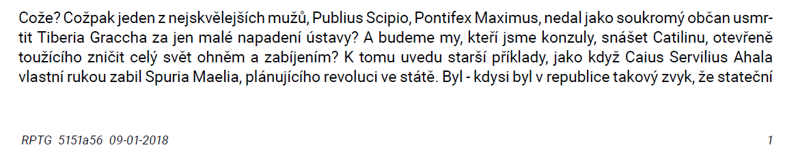

# A simple report template for R
Geared towards corporate (i.e. not academic) use.

My work is unlikely to appear in any reputable journals, and so I have little need for Elsevier or PeerJ templates, but I felt the need to address several issues specific to the corporate environment.  
I have therefore compiled a simple r markdown template, together with an accompanying .tex file to create simple yet (I hope) elegant pdf reports.

## A few features I found advantageous:  
* I like even my intermediate reports to be read only, hence my output is by choice *.pdf*, not more common MS Word.  
* I have struggled with finding a sans serif font that would be easily available in both Linux and Windows environment, after a while I settled on [Roboto](https://fonts.google.com/specimen/Roboto). The usual suspects Arial and Helvetica turned out to be unreliable in this regard.
* My reports often take a life of their own once out of my hands; to improve version control I have created 'version' field in the front matter of my report, together with corresponding code in my .tex template which places the short form SHA of the last commit in the left hand footer of each page. This way I can be certain at which iteration of my analysis a report was generated.
``` yaml
version: " SHA: `r system('git rev-parse --short=7 HEAD', intern=TRUE)`" 
```  


As I needed a text with Czech accents the placeholer "report" is not the usual *Lorem ipsum*, but Czech translation of Cicero's first Catiline oration.
